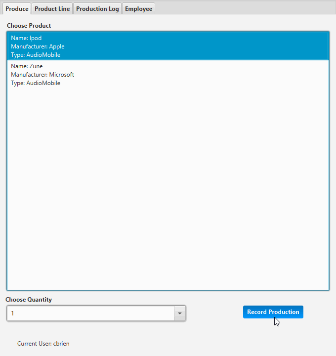

## Production Line Tracker GUI
This is a project that I did for my Object Oriented Programming class. The goal of this project was to create software 
that could be used by a fictional production facility that makes media players. This product was designed to have a 
graphical user interface that would allow the user to track the production of products, add new products to be produced,
create an employee account, and view the products that have already been created. The information about the products is
stored in a database so that it can be saved between uses. This project was completed during my Junior year as an FGCU 
student studying software engineering. This software was made utilizing the object oriented style to learn the concepts
of Object-oriented programming. Some parts of this project are not integrated into the GUI and are only to demonstrate 
Object-oriented programming concepts. 

## Documentation
This program was documented using javadoc style comments.
Documentation can be seen at:  
https://brien17.github.io/ProductionLineTrackerGUI/

## Demonstration
This animation shows some of the features of my program in action. 

## Getting started
To run this program you will need to have the Java Runtime Environment installed.  Available here: https://java.com 
Then simply download the zip of this repository and extract it. Then run the file named "ProductionLineTrackerGUI.jar". 
The program should open up in a new window.

## Built with
* Java
* IntelliJ
* Hard Work

## Contributing 
I am not seeking any contributions to this project, but you are free to download it and use or modify it as you wish.

## License
This program is licensed under the GNU General Public License v3.0. You are free to use or modify this software as 
desired. 

## Acknowledgements
* Professor Vanselow
* docs.oracle.com
* tutorialspoint.com
* stackoverflow.com

## Potential Improvements
There are many things that could be added to improve this project. The main things that I would like to improve are the 
utilization of the AudioPlayer and MoviePlayer classes. These are not used in the graphical user interface of the 
program, as they were included primarily to facilitate understanding of object-oriented programming concepts. In the 
future, I would be interested in incorporating these into the main part of the program. Additionally, the login and employee 
account system was added late into the development and could be better fleshed out and explained.

## Key Programming Concepts Utilized
The main learning goal of this program was to understand more about object-oriented design by creating a program that 
utilized many of the concepts of object-oriented programming. This project utilizes design ideas, such as, encapsulation
inheritance, and polymorphism to demonstrate proficiency with object-oriented design concepts.

## Problem Statement
This was the problem statement used for the creation of this program.

**Scenario**

You have been hired to create software for a media player production facility that will keep track of what products are produced.

Without the software, workers on the production floor are physically producing items and having to write down what is produced in a production log book.

Management would like the production tracking to be more automated so the workers don't need to spend as much time recording what was produced, the log will be more accurate, and it will be easier to generate production reports.

In addition to the ability to record production, the software also needs the ability to add to the product line (the catalog of products that are able to be produced).

-   **Goals** (high level intended outcomes; for software, a Product Backlog)
    -   Hypothetical / Real world
        1.  Allow a user to add new products that are able to be produced and store them in a collection.
        2.  The collection of products that can be produced can be displayed at any time.
        3.  Allow a user to track production of products, including specifying how many items of that product were created. The program will then create a record for each of these items and store them in a collection.
        4.  The collection of created items can be displayed at any time.
        5.  Production statistics can be displayed – Total items produced, number of each item type, the number of unique products created etc.
        6.  Employee accounts can be made.
        7.  Allow easy modification to handle different products.
    -   Actual / For class
        1.  Solidify understanding of object oriented programming.
        2.  Practice Java.
        3.  Learn basic graphical user interface (GUI) programming.
        4.  Learn basic database programming.
-   **Boundaries / Scope** (where the functions and responsibilities of the solution start and end / what it should do and what is left to other systems to do)
    -   Hypothetical / Real world
        -   For this particular production facility you will only need to track music and movie players.
        -   The program does not need the ability to place or fulfill orders / reduce stock, just track production.
    -   Actual / For class
        -   TBD
-   **Success criteria** (set of conditions to be satisfied at completion; must be measurable and verifiable, like a test)
    -   Hypothetical / Real world
        -   Pass tests (in repl.it)
        -   Follow rules for documentation, style, and coding conventions
    -   Actual / For class
        -   Grading forms / rubrics (in Canvas)
            -   Documentation (see below)
            -   Style (see below)
            -   Quality (see below)
            -   Assignment Specifications - include full project in your repository so your program can be easily imported and run.
        -   Creation of artifact for portfolio
-   **Constraints** (externally imposed limitations on system requirements, design, or implementation or on the process used to develop or modify a system)
    -   Hypothetical / Real world
        -   The program will be a GUI database program written in Java.
        -   The program must be flexible to allow for future expansion.
        -   Code should be saved to a private GitHub repository.
        -   Follow best practices for style, documentation, and quality.
    -   Actual / For class
        -   Communication and collaboration with classmates is allowed but should not extend to sharing actual code.
-   **Assumptions** (things that are accepted as true or as certain to happen, without proof)
    -   You like to program.
    -   You have foundational knowledge of programming from prerequisite courses.
    -   You will spend at least 4 hours per week on the project.
    -   The project should not require more than 7 hours per week. If so, contact the professor for assistance.
    -   This will help you be successful in future classes and your career.
-   **Stakeholders** (individuals or organizations having a right, share, claim, or interest in a system or in its possession of characteristics that meet their needs and expectations )
    -   Hypothetical / Real world
        -   CEO
        -   CTO
        -   CIO
        -   users
            -   production facility workers
            -   inventory managers
        -   customers
        -   I.T. support
    -   Actual / For class
        -   Yourself
        -   Future potential employers
        -   Professor
-   **Timelines** (a breakdown of the Product Backlog into time-bound smaller, more detailed tasks in Sprint Backlogs)
    -   Three 5-week sprints, detailed below.
